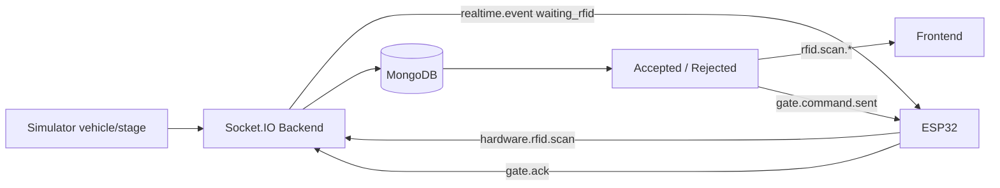

# NT131 Backend

## Overview

The backend is the coordination center of the Smart Parking system. It provides the REST API, Socket.IO realtime gateway, MongoDB integration, and ESP32 hardware bootstrap configuration.

The backend handles:

- Operator/admin authentication and authorization.
- Resident, vehicle, RFID card, and pricing policy management.
- Parking session, slot, and parking status management.
- Checkpoint and vehicle stage events from the 3D simulator.
- RFID scan events from ESP32.
- `open`/`close` gate commands sent to ESP32 through Socket.IO.
- Realtime event broadcasts to the frontend, simulator, and hardware.

## Technologies

- Node.js + TypeScript
- Express 5
- MongoDB + Mongoose
- Socket.IO
- JWT
- Joi validation
- Docker

## Installation and Local Development

```bash
cd backend
cp .env.example .env
npm install
npm run dev
```

Defaults:

- API: `http://localhost:5000/api/v1`
- Socket.IO: `http://localhost:5000/socket.io`

Build TypeScript:

```bash
npm run build
```

Run with `tsx`:

```bash
npm start
```

## Environment Variables

```env
PORT=5000
NODE_ENV=development
MONGODB_URI=mongodb://localhost:27017/nt131
JWT_SECRET=replace-with-a-strong-secret
JWT_EXPIRES_IN=7d
JWT_REFRESH_SECRET=replace-with-a-strong-refresh-secret
JWT_REFRESH_EXPIRES_IN=30d
SOCKET_CORS_ORIGIN=http://localhost:5173,http://localhost:5174
SIMULATOR_API_KEY=
HARDWARE_BOOTSTRAP_KEY=
HARDWARE_SOCKET_HOST=
HARDWARE_SOCKET_PORT=
HARDWARE_SOCKET_PATH=/socket.io
HARDWARE_SOCKET_RECONNECT_INTERVAL_MS=5000
ADMIN_USERNAME=
ADMIN_PASSWORD=
ADMIN_FULL_NAME=
```

Hardware-related notes:

- `HARDWARE_BOOTSTRAP_KEY`: if set, ESP32 must send the `x-hardware-key` header when calling bootstrap.
- `HARDWARE_SOCKET_HOST`: LAN IP returned to ESP32, for example `192.168.1.5`.
- `HARDWARE_SOCKET_PORT`: backend socket port, usually `5000` for local development or `3000` for Docker.
- `HARDWARE_SOCKET_PATH`: keep `/socket.io` unless the server path is changed.
- `SIMULATOR_API_KEY`: key used by simulator and ESP32-related simulator-compatible flows.

## API Routes

All routes are under `/api/v1`:

- `GET /api/v1/`
- `/api/v1/auth`
- `/api/v1/hardware/bootstrap`
- `/api/v1/residents`
- `/api/v1/rfid-cards`
- `/api/v1/vehicles`
- `/api/v1/pricing-policies`
- `/api/v1/parking/sessions`
- `/api/v1/parking/slots`
- `/api/v1/parking/status`

Hardware bootstrap endpoint:

```bash
curl -H "x-hardware-key: YOUR_BOOTSTRAP_KEY" \
  http://localhost:5000/api/v1/hardware/bootstrap
```

The response returns `socketHost`, `socketPort`, `socketPath`, `simulatorApiKey`, and `reconnectIntervalMs` so ESP32 can connect to the realtime gateway.

## Socket.IO Rooms and Events

Socket.IO runs at `/socket.io`.

| Client | Join event | Role |
| --- | --- | --- |
| Operator/admin frontend | `operator.join` | Receive realtime events and send manual gate commands |
| 3D simulator | `simulator.join` | Send checkpoints/stages and receive state for animation |
| ESP32 hardware | `hardware.join` | Send RFID scans, receive gate commands, send ACKs |

Important events:

- `realtime.event`: shared envelope broadcast to rooms.
- `simulator.vehicle.checkpoint`: simulator reports that a vehicle reached a checkpoint.
- `simulator.stage.changed`: simulator reports a stage such as `waiting_rfid`.
- `hardware.rfid.scan`: ESP32 sends RFID UID data.
- `operator.gate.command.request`: operator sends a manual gate command.
- `simulator.gate.command.request`: simulator/test scripts send gate commands.
- `gate.ack`: ESP32 replies to gate commands for RTT/ACK testing.

## RFID Flow With ESP32



The backend needs the latest license plate snapshot from the simulator for each checkpoint. If ESP32 sends an RFID scan before a plate snapshot exists, the backend rejects it with `plate_not_detected`.

## Source Structure

```text
src
├── config        # Database connection
├── controllers   # Express controllers
├── middlewares   # Auth, logging, rate limit, error handling
├── models        # Mongoose models
├── repositories  # Data access
├── routes        # API routes
├── services      # Business logic, Socket.IO, realtime, hardware gateway
├── types         # TypeScript contracts
├── utills        # Logger, error, password/JWT helpers
└── validators    # Joi validators
```

## Backend/Hardware Testing

The test suite is in `../tools` and connects to the backend through Socket.IO:

```bash
cd ../tools
npm install
SOCKET_HOST=http://localhost:5000 npm run test:test1
SOCKET_HOST=http://localhost:5000 npm run test:test3
SOCKET_HOST=http://localhost:5000 npm run test:test7
```

Results:

- `tools/results/*.json`
- `tools/charts/*.png`

Metrics to monitor when evaluating FreeRTOS:

- `sentTotal`, `acks`, and `lostCount`.
- Average RTT, p95, p99, and max.
- Reconnect count in `Test7`.
- ESP32 Serial metrics: heap, queue load, and stack high-water marks.

## Related Documentation

- `../README.md`
- `../hardware/README.md`
- `../docs/architecture/realtime-event-contract.md`
- `../docs/architecture/operator-integration-contract.md`
