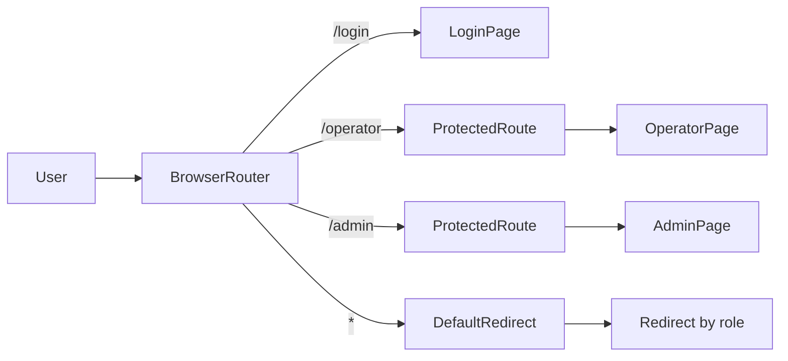
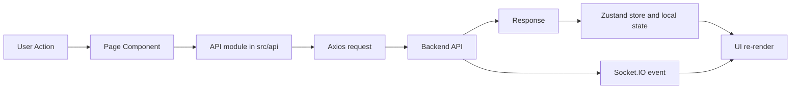

# NT131 Frontend Console

## Description
This is the frontend dashboard for NT131 Smart Parking.

It provides a role-based interface for:
- Operator workflow (RFID verification, gate control, parking status).
- Admin workflow (management and monitoring pages).

Built with React, TypeScript, and Vite for educational and integration purposes.

## Technologies
We are using the following technologies:

- React
- TypeScript
- Vite
- React Router
- Zustand
- Axios
- Socket.IO Client
- ESLint

## Installation and Running
### Prerequisites
- Node.js 22+
- Backend service running (default local URL: `http://localhost:5000`)

### Environment
Create `.env` from the provided example:

```bash
cp .env.example .env
```

Default `.env` values:

```env
VITE_API_BASE_URL=http://localhost:5000/api/v1
VITE_SOCKET_URL=http://localhost:5000
VITE_SIMULATOR_API_KEY=
```

### Run application
```bash
npm install
npm run dev
```

After running, open the app at the Vite URL (usually `http://localhost:5173`).

Build for production:

```bash
npm run build
```

Preview production build:

```bash
npm run preview
```

## Project Structure
This frontend is organized by feature and shared layers:

```text
src
├── api          # HTTP clients and API modules
├── components   # Shared UI components
├── hooks        # Custom React hooks
├── lib          # Utility helpers
├── pages        # Route-level pages (login/operator/admin)
├── store        # Zustand state stores
├── types        # TypeScript types/interfaces
├── App.tsx      # Route setup and protected route logic
└── main.tsx     # App bootstrap
```

## Routes
Main app routes:

- `/login`: authentication page
- `/operator`: operator dashboard
- `/admin`: admin dashboard

Unknown routes are redirected based on current authenticated role.

### Route Flowchart


## Workflow of a Frontend Request
1. User interacts with page components.
2. Page calls API functions in `src/api`.
3. Backend returns REST data and emits realtime events.
4. Frontend store/state updates UI.

### Workflow Flowchart


## Development
Current focus:
- Keep operator/admin flows stable with backend API contracts.
- Keep realtime Socket.IO handling aligned with backend event contracts.

Planned improvements:
- Add integration tests for critical operator actions.
- Add UI/UX and accessibility refinements.

## References
- React documentation
- Vite documentation
- TypeScript documentation
- Socket.IO documentation
