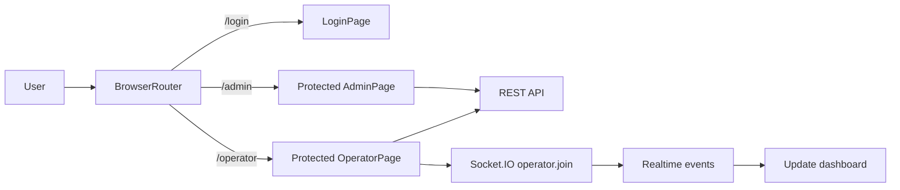

# NT131 Frontend Console

## Overview

The frontend is the smart parking operations dashboard. It connects to the backend through REST API and Socket.IO so operators and admins can monitor realtime state from the 3D simulator and real ESP32 hardware.

The app supports:

- Login and role-based navigation.
- Operator workflow for RFID, license plate, entry/exit gates, and parking status.
- Admin workflow for system data management.
- Realtime event feed from the backend: sessions, gates, slots, RFID, and vehicle state.
- Toast notifications for actions and errors.

## Technologies

- React 19
- TypeScript
- Vite
- React Router
- Zustand
- Axios
- Socket.IO Client
- ESLint

## Requirements

- Node.js 22+
- Running backend service, default local URL: `http://localhost:5000`
- For realtime ESP32/simulator workflows, configure the backend with `SIMULATOR_API_KEY`, `HARDWARE_*`, and CORS values.

## Installation and Running

```bash
cd frontend
cp .env.example .env
npm install
npm run dev
```

Open the Vite URL shown in the terminal, usually `http://localhost:5173`.

Build for production:

```bash
npm run build
```

Preview production build:

```bash
npm run preview
```

## Environment Variables

`.env.example`:

```env
VITE_API_BASE_URL=http://localhost:5000/api/v1
VITE_SOCKET_URL=http://localhost:5000
VITE_SIMULATOR_API_KEY=
```

Notes:

- `VITE_API_BASE_URL`: REST API base URL.
- `VITE_SOCKET_URL`: backend Socket.IO host.
- `VITE_SIMULATOR_API_KEY`: available for local simulator-related integration flows.

When running through Docker Compose, build args in `docker-compose.yml` point the app to `http://localhost:3000`.

## Project Structure

```text
src
├── api          # Axios client and API modules
├── components   # Shared components: dashboards, frame, event feed, status cards
├── hooks        # Operator realtime hooks
├── lib          # Auth/session/socket/toast helpers
├── pages        # Login, operator, admin
├── store        # Zustand stores
├── types        # TypeScript contracts with backend/realtime events
├── App.tsx      # Router and protected routes
└── main.tsx     # React app bootstrap
```

## Routes

- `/login`: login page.
- `/operator`: operator dashboard.
- `/admin`: admin dashboard.

Unknown routes are redirected based on authentication state and current role.


```mermaid
flowchart LR
  U[User] --> BR[BrowserRouter]
  BR -->|/login| L[LoginPage]
  BR -->|/operator| OP[Protected OperatorPage]
  BR -->|/admin| AD[Protected AdminPage]
  OP --> API[REST API]
  AD --> API
  OP --> SIO[Socket.IO operator.join]
  SIO --> EVT[Realtime events]
  EVT --> UI[Update dashboard]
```

## Realtime Integration

The frontend listens for `realtime.event` from the backend and updates the UI for events such as:

- `rfid.scan.requested`
- `rfid.scan.accepted`
- `rfid.scan.rejected`
- `gate.command.sent`
- `gate.state.changed`
- `vehicle.state.changed`
- `session.created`
- `session.updated`
- `session.completed`
- `slot.assigned`
- `slot.released`

Expected operations flow:

1. The simulator moves a vehicle to a checkpoint and emits `simulator.stage.changed`.
2. ESP32 scans a real RFID card and sends `hardware.rfid.scan`.
3. The backend processes the scan and emits accepted/rejected events.
4. The operator sees the updated state on the dashboard.
5. Gate commands are sent by the backend to ESP32 through Socket.IO, and the frontend updates gate state in realtime.

## Frontend Checks

Quick checks:

```bash
npm run build
npm run lint
```

Integration check:

1. Start the backend.
2. Start the frontend.
3. Start the 3D simulator or ESP32 hardware.
4. Log in as operator/admin.
5. Watch the event feed while the simulator/ESP32 emits RFID, gate, and parking session events.

To evaluate realtime latency for the ESP32 FreeRTOS workflow, use the scripts in the root `tools` directory. The frontend acts as the operations observer for those tests.

## Related Documentation

- `../backend/README.md`
- `../hardware/README.md`
- `../docs/architecture/realtime-event-contract.md`
- `../docs/architecture/operator-integration-contract.md`
