# NT131 Hardware ESP32

## Overview

The `hardware` directory contains firmware for the ESP32 gate/socket controller. This firmware connects real hardware to the Smart Parking backend:

- Connect to WiFi.
- Call backend bootstrap to fetch Socket.IO configuration.
- Join the `hardware` room.
- Receive realtime events from the backend.
- Read RFID cards with RC522.
- Control two servos for entry and exit gates.
- Display status on a 16x2 I2C LCD.
- Run FreeRTOS multitasking to reduce latency and avoid missing events while a servo is moving.

Main firmware files:

```text
hardware/esp32-gate-socket-controller/
├── esp32-gate-socket-controller.ino
├── freertos-tasks.cpp
├── freertos-tasks.h
├── FREERTOS_IMPLEMENTATION.md
└── hardware_config.h
```

The sample configuration file is `hardware/hardware_config.example.h`.

## Hardware

- ESP32 DevKit.
- RC522/MFRC522 RFID reader.
- 2 servos: entry gate and exit gate.
- 16x2 I2C LCD, default address `0x27`.
- Suitable external power supply for servos.
- Jumper wires, breadboard, or power module.

## Default Wiring

| Device | Default ESP32 pin | Note |
| --- | --- | --- |
| Entry servo | GPIO13 | `HW_ENTRY_SERVO_PIN` |
| Exit servo | GPIO12 | `HW_EXIT_SERVO_PIN` |
| RC522 SDA/SS | GPIO5 | `SS_PIN` |
| RC522 SCK | GPIO18 | SPI |
| RC522 MOSI | GPIO23 | SPI |
| RC522 MISO | GPIO19 | SPI |
| RC522 RST | GPIO17 | `RST_PIN` |
| RC522 VCC | 3V3 | Do not power RC522 with 5V |
| RC522 GND | GND | Common ground |
| LCD SDA | GPIO21 | ESP32 default I2C |
| LCD SCL | GPIO22 | ESP32 default I2C |

If your board uses different pins, edit `hardware_config.h`.

## Firmware Configuration

Copy the sample config:

```bash
cp hardware/hardware_config.example.h hardware/esp32-gate-socket-controller/hardware_config.h
```

Edit these values:

```cpp
#define HW_WIFI_SSID "YOUR_WIFI_NAME"
#define HW_WIFI_PASSWORD "YOUR_WIFI_PASSWORD"

#define HW_BOOTSTRAP_HOST "192.168.x.x"
#define HW_BOOTSTRAP_PORT 5000
#define HW_BOOTSTRAP_PATH "/api/v1/hardware/bootstrap"
#define HW_HARDWARE_BOOTSTRAP_KEY "YOUR_BOOTSTRAP_KEY"

#define HW_ENTRY_SERVO_PIN 13
#define HW_EXIT_SERVO_PIN 12

#define SIMULATOR_KEY "YOUR_SIMULATOR_KEY"
#define SS_PIN 5
#define RST_PIN 17
```

Backend `.env` should match:

```env
HARDWARE_BOOTSTRAP_KEY=YOUR_BOOTSTRAP_KEY
HARDWARE_SOCKET_HOST=192.168.x.x
HARDWARE_SOCKET_PORT=5000
HARDWARE_SOCKET_PATH=/socket.io
HARDWARE_SOCKET_RECONNECT_INTERVAL_MS=5000
SIMULATOR_API_KEY=YOUR_SIMULATOR_KEY
```

`HW_BOOTSTRAP_HOST` is the LAN IP of the machine running the backend.

## Required Arduino Libraries

Install these from Arduino IDE Library Manager:

- `ArduinoJson`
- `Socket.IO`
- `ESP32Servo`
- `MFRC522`
- `LiquidCrystal_I2C`

Board: ESP32 Dev Module, or the ESP32 board that matches your hardware.

## Upload and Run

1. Open `hardware/esp32-gate-socket-controller/esp32-gate-socket-controller.ino`.
2. Select the ESP32 board and serial port.
3. Upload the firmware.
4. Open Serial Monitor.
5. Check for logs such as:

```text
[WiFi] Connected
[Bootstrap] Config loaded from backend env
[FreeRTOS] Queues and mutexes created
[FreeRTOS] All tasks created
[taskSocketIO] started
[taskRfidPolling] started
[taskServoControl] started
[taskWifiManager] started
[taskLcdDisplay] started
[taskMetrics] started
```

When Socket.IO connects successfully, ESP32 sends `hardware.join` and the backend logs that hardware is connected.

## FreeRTOS Tasks

| Task | Core | Priority | Function |
| --- | --- | --- | --- |
| `taskSocketIO` | 1 | 3 | Run `socketIO.loop()`, join hardware, emit queued RFID events |
| `taskRfidPolling` | 0 | 3 | Poll RC522 when `rfidScanEnabled=true` |
| `taskServoControl` | 0 | 2 | Receive `ServoCommand` from queue and control servos |
| `taskWifiManager` | 1 | 2 | Monitor WiFi and reconnect on disconnect |
| `taskLcdDisplay` | 0 | 1 | Display messages from `queueDisplay` |
| `taskMetrics` | 1 | 1 | Print heap/queue/stack telemetry every 10 seconds |

Queues and mutexes:

- `queueServoCommand`: open/close gate commands.
- `queueRfidEvent`: RFID UIDs read by hardware.
- `queueWifiStatus`: WiFi status changes.
- `queueDisplay`: LCD messages.
- `mutexSocketIO`: protects the Socket.IO singleton.
- `mutexServoState`: protects servo angle state.
- `mutexLcd`: protects I2C LCD access.

Why FreeRTOS is used:

- Servo sweeps include step delays; a blocking `loop()` would slow Socket.IO/RFID handling.
- RFID must be polled continuously while a vehicle is at a checkpoint.
- Socket.IO needs a steady loop to avoid delayed gate commands and realtime events.
- The metrics task provides performance telemetry during load tests.

## Backend Flow

```mermaid
flowchart LR
  ESP[ESP32 boot] --> WIFI[Connect WiFi]
  WIFI --> BOOT[GET /api/v1/hardware/bootstrap]
  BOOT --> SIO[Connect Socket.IO]
  SIO --> JOIN[hardware.join]
  JOIN --> WAIT[Wait realtime.event]
  WAIT --> RFID[waiting_rfid -> enable RC522]
  RFID --> SCAN[hardware.rfid.scan]
  SCAN --> CMD[gate.command.sent]
  CMD --> SERVO[Queue servo command]
  SERVO --> ACK[gate.ack / metrics]
```



## Test RFID Without a Physical Card

The firmware supports UID input through Serial Monitor:

```text
RFID:<UID>
RFID_ENTRY:<UID>
RFID_EXIT:<UID>
UID:<UID>
```

Example:

```text
RFID_ENTRY:B19DE116
```

Note: the firmware only emits RFID scans to the backend while the current stage is `waiting_rfid`. This stage is usually emitted by the simulator when a vehicle reaches a checkpoint.

## FreeRTOS Effectiveness Testing

Use the test suite in `tools` from the repository root:

```bash
cd tools
npm install
SOCKET_HOST=http://192.168.1.5:5000 npm run test:test1
SOCKET_HOST=http://192.168.1.5:5000 npm run test:test2
SOCKET_HOST=http://192.168.1.5:5000 npm run test:test3
SOCKET_HOST=http://192.168.1.5:5000 npm run test:test7
```

Test meanings:

- `Test1`: multiple gate commands close together; checks whether the servo task delays socket handling.
- `Test2`: alternating entry/exit gates; checks both servos and backend state.
- `Test3`: burst command flood; checks queues, ACKs, and lost count.
- `Test4`: measures `gate.state.changed` event latency.
- `Test5`: RFID rejection path.
- `Test6`: RFID accepted path with real data in the database.
- `Test7`: Socket.IO disconnect and reconnect behavior.

Metrics to collect:

- From `tools/results/*.json`: `sentTotal`, `acks`, `lostCount`, `avgRttMs`, `p95RttMs`, `p99RttMs`, `maxRttMs`.
- From `tools/charts/*.png`: RTT charts per test.
- From Serial Monitor: `[metrics]` lines containing heap, min heap, queue used/free, and stack high-water marks.

When FreeRTOS is working well:

- Gate commands still ACK while a servo is moving.
- RFID scans are not missed during gate open/close.
- `lostCount` is low or zero under moderate load.
- Queues do not remain full.
- Stack high-water marks have enough headroom.
- WiFi reconnect can be observed in `Test7`.

## Troubleshooting

### ESP32 cannot bootstrap

- Check that `HW_BOOTSTRAP_HOST` is the backend LAN IP.
- Check that the backend is running and the port is reachable.
- If the backend sets `HARDWARE_BOOTSTRAP_KEY`, ESP32 must use the same `HW_HARDWARE_BOOTSTRAP_KEY`.

### Gate commands are not received

- Check backend logs for `ESP32 hardware connected`.
- Check that Socket.IO path is `/socket.io`.
- Check that ESP32 joined `hardware`.
- Check that `HARDWARE_SOCKET_HOST` returns a backend IP reachable from ESP32.

### RFID does not emit

- Check RC522 wiring, 3.3V power, and SPI pins.
- Check that the simulator emitted the `waiting_rfid` stage.
- Test from Serial Monitor with `RFID_ENTRY:<UID>`.

### Servo does not move

- Check `HW_ENTRY_SERVO_PIN` and `HW_EXIT_SERVO_PIN`.
- Use an external power supply with enough current for the servo and connect common GND with ESP32.
- Watch `taskServoControl` logs to confirm commands reach the queue.

## Related Documentation

- `esp32-gate-socket-controller/FREERTOS_IMPLEMENTATION.md`
- `../backend/README.md`
- `../README.md`
- `../docs/architecture/realtime-event-contract.md`
