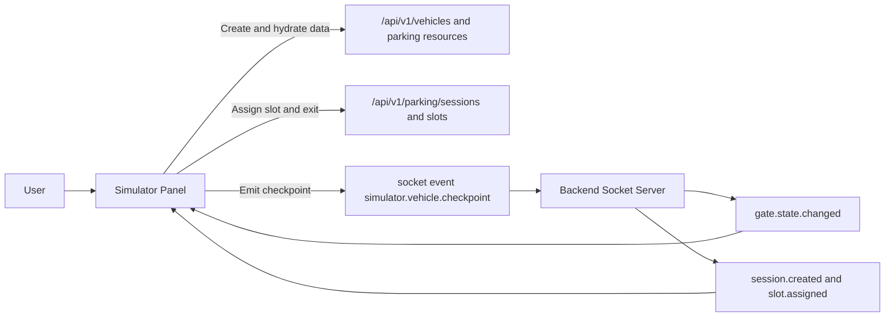
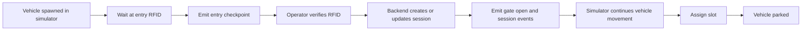

# NT131 Simulator 3D

## Description
This is a standalone 3D simulator for NT131 Smart Parking.

It is used to simulate vehicle entry and exit behavior and verify realtime integration with backend and operator dashboard.

The simulator can:
- Spawn vehicles and animate movement in a 3D parking scene.
- Emit RFID checkpoint events to backend.
- Receive realtime gate/session/slot updates and continue the vehicle journey.

## Technologies
We are using the following technologies:

- React
- TypeScript
- Vite
- Three.js
- React Three Fiber
- Drei
- Axios
- Socket.IO Client

## Installation and Running
### Prerequisites
- Node.js 22+
- Backend service running (default local URL: `http://localhost:5000`)

### Environment
Create `.env` in this folder:

```env
VITE_API_BASE_URL=http://localhost:5000/api/v1
VITE_SOCKET_URL=http://localhost:5000
VITE_SIMULATOR_API_KEY=
```

`VITE_SIMULATOR_API_KEY` must match backend `SIMULATOR_API_KEY` when simulator room auth is enabled.

### Run application
```bash
npm install
npm run dev
```

After running, open the Vite URL shown in terminal (usually `http://localhost:5174` or next free port).

Build for production:

```bash
npm run build
```

Preview production build:

```bash
npm run preview
```

## Docker
This app can be started through root Docker Compose as service `simulator-3d`:

```bash
docker compose up --build simulator-3d
```

## Project Structure
The simulator app is structured as follows:

```text
src
├── components   # 3D scene, control panel, event feed UI
├── lib          # API and Socket.IO integration helpers
├── types        # Shared TypeScript types
├── App.tsx      # Main simulator layout
└── main.tsx     # App bootstrap
```

## Route and Event Flow
### Route Flowchart


## Realtime Flow
1. Vehicle reaches `entry_rfid` checkpoint in simulator.
2. Simulator emits checkpoint event to backend.
3. Operator verifies RFID on dashboard.
4. Backend emits session and gate state events.
5. Simulator receives events and moves vehicle through gate to slot.

### Workflow Flowchart


## End-to-end Quick Test
1. Start backend.
2. Start frontend and open operator page.
3. Start simulator.
4. Simulate entry and verify operator receives live plate/checkpoint.
5. Complete RFID verification in operator and verify vehicle continues to parking slot.

Detailed checklist: `docs/architecture/simulator-operator-e2e-checklist.md`.

## Troubleshooting
- If socket connection fails, verify `VITE_SOCKET_URL` and backend CORS settings.
- If vehicle does not continue after RFID approval, verify `session.created` and `gate.state.changed` events are received.
- If build fails after dependency update, reinstall packages with `npm install`.

## References
- Three.js documentation
- React Three Fiber documentation
- Socket.IO documentation
